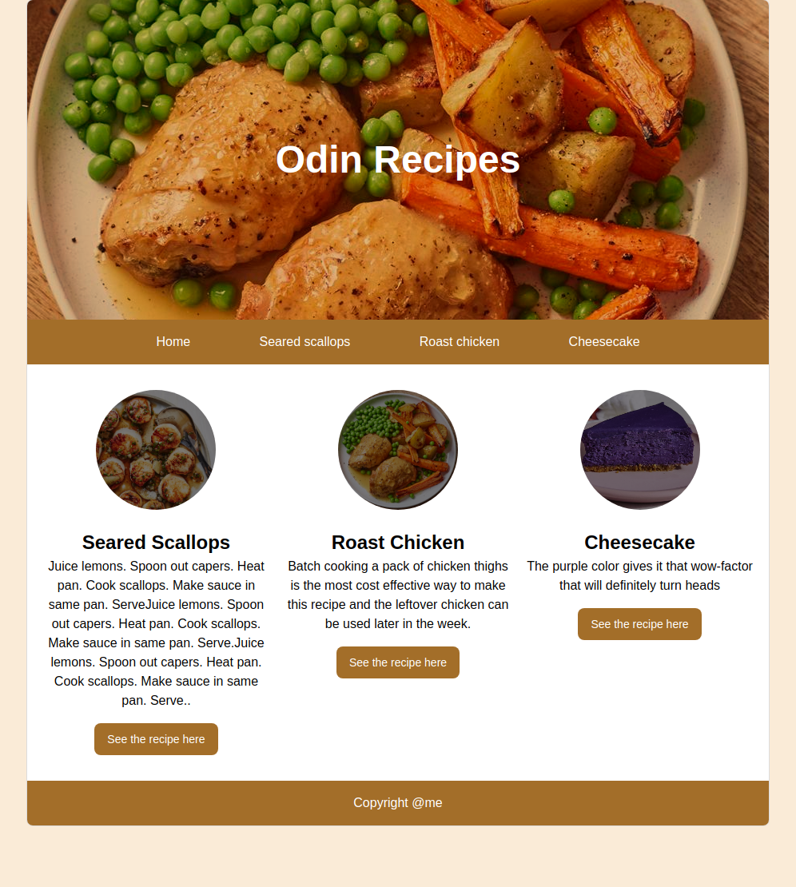
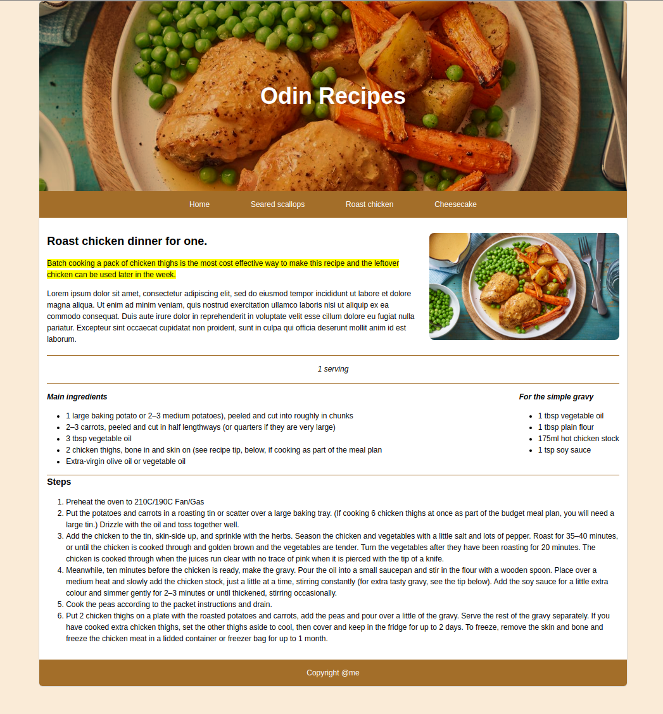

# odin-recipes
This is the first assignment from The Odin Project website. This project will be updated during the frontend mentorate.

This will be a simple recipes website, at the beggining. I hope to visually improve the layout once I will learn more.

# Final
[The final deployment](https://mariante0dorescu.github.io/odin-recipes/)

# update 18.01.2023
this exercise is complete. While working on this, I've started using the flex containers, which are great in creating fluid layout.
I run into some problems, one of them is aligning the main page button to be on the same.
If you are interested on how this turn out, please check the attached screenshots or see the live preview [here](https://mariante0dorescu.github.io/odin-recipes/).

# update 19.01.2023
I found the solution on how to align the buttons.

